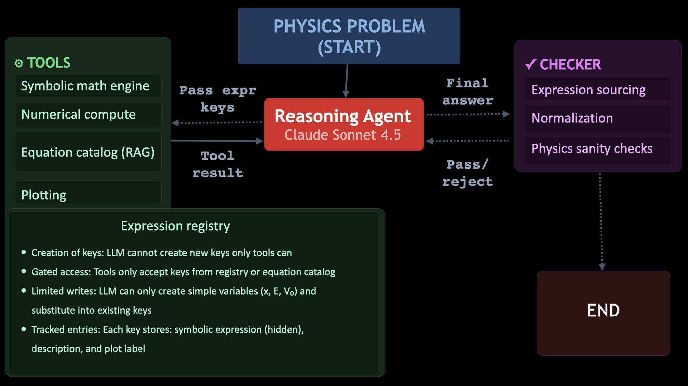
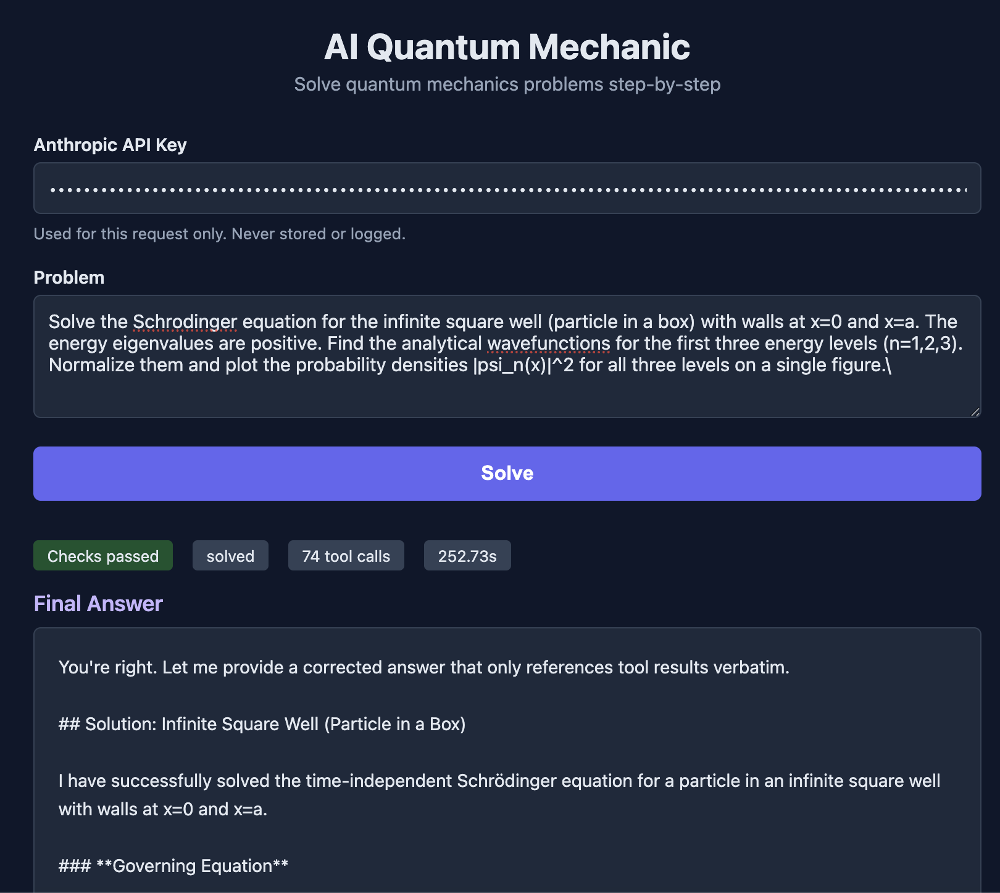

# AI-QuantumMechanic

A prototype LLM agent that solves graduate-level quantum mechanics problems through tool orchestration. Built with [LangGraph](https://github.com/langchain-ai/langgraph) and powered by Anthropic's Claude Sonnet 4.5, the agent derives solutions step-by-step using symbolic and numerical tools rather than recalling formulas from memory. The agent is instructed to always attempt an analytical solution first, falling back to numerical methods only when necessary.

## Architecture

The agent runs as a three-node LangGraph loop:

1. **Reasoning**: Claude Sonnet receives the conversation history and decides the next step, either call a tool or present a final answer.
2. **Tool Execution**: Dispatches the requested tool, stores the result in the expression registry, and returns it to the reasoning node.
3. **Checker**: Validates the final answer against physics constraints before accepting it. If checks fail, the agent is sent back to fix its answer (up to 2 retries).



The LangGraph node/edge diagram can be regenerated via [`diagram/architecture.ipynb`](diagram/architecture.ipynb).

## Tools

### Symbolic Math (`tools/symbolic_math.py`)
The core tool, wrapping SymPy for over 20 operations:
- **Basic**: arithmetic (add, multiply, divide), substitute, simplify
- **Algebra**: solve, solveset, set_equal
- **Calculus**: differentiate, integrate, solve_ode, limit, asymptotic
- **Quantum-specific**: commutator, time_evolution, fourier_transform, eigenvalues
- **Available special functions**: Hermite, Laguerre, spherical harmonics, Parabolic Cylinder D (custom SymPy class since it is not built into SymPy, defined in `tools/special_functions.py`)

### Numerical Compute (`tools/numerical_compute.py`)
SciPy/NumPy-based operations for problems that cannot be solved analytically:
- Numerical root finding and polishing
- ODE integration (shooting method)
- Boundary value problem solver
- Numerical quadrature

### Plot Results (`tools/plot_results.py`)
Matplotlib wrapper for generating wavefunction and probability density plots.

### Equation Catalog with RAG (`tools/equations.py`)
A catalog of 43 quantum mechanics equations across 7 categories, stored as JSON files in `data/equations/`. The agent can browse, retrieve, or **semantically search** the catalog using natural language via ChromaDB vector embeddings.

**How it works:**
1. On startup, `tools/catalog_loader.py` loads and merges all JSON files from `data/equations/` into a single in-memory catalog.
2. `tools/vector_store.py` indexes each equation's `search_text` field into a ChromaDB collection using the all-MiniLM-L6-v2 ONNX embedding model (runs locally, no API calls).
3. The `lookup_equation` tool exposes three operations:
   - **list**: Browse all equations, optionally filtered by tag
   - **get**: Retrieve metadata for a specific equation by key
   - **search**: Semantic search with natural language (e.g., "particle in a box" returns `infinite_square_well_potential`)

The agent never sees raw SymPy expression strings from search results. To use an equation, it must call `symbolic_math(operation="substitute", equation_key=...)`.

**Equation categories:** `schrodinger.json`, `potentials.json`, `operators.json`, `hydrogen.json`, `perturbation.json`, `spin.json`, `scattering.json`

### Expression Registry (`tools/expression_registry.py`)
The expression registry is the central mechanism that prevents the LLM from hallucinating physics equations. It works as a shared memory between the tools and the agent.

**How it works:** Every time a tool produces a result (solving an ODE, differentiating, substituting, etc.), it stores the resulting SymPy expression in an in-memory dictionary under an opaque key like `expr_1`, `expr_2`, and so on. The tool then returns this key along with a human-readable string of the expression back to the agent. The agent can read the expression string to reason about what to do next, but when it calls the next tool, it must pass the key, not the expression itself.

```python
_REGISTRY[key] = {
    "expr": sympy_obj,       # the actual SymPy object (only tools can access this)
    "description": "...",    # verbose text returned to the LLM for reasoning
    "label": "...",          # short label for plot legends
}
```

**Why this matters:** The agent cannot inject arbitrary formulas. If it needs to build a compound expression like `hbar*omega/2`, it must do so through tool operations (e.g., look up a catalog equation, substitute values, simplify). The only things the agent can write directly are simple values like a single variable `"x"` or a number `"3"`. Anything more complex must be referenced from the registry using `@key` syntax. This forces every expression in the agent's derivation to have a verifiable origin in a tool computation.

## Checkers

After the agent presents its final answer, three checkers validate it:

1. **Expression Sourcing** (`checkers/expression_sourcing.py`): Verifies that every equation in the final answer traces back to a tool result. Catches recalled or hallucinated formulas.
2. **Normalization** (`checkers/normalization.py`): Confirms that wavefunctions are properly normalized (integral of |psi|^2 = 1), with support for Cartesian, spherical, cylindrical, and polar coordinates.
3. **Physical Sanity** (`checkers/physical_sanity.py`): Checks energy ordering (E_0 < E_1 < E_2), bound state signs, and probability density non-negativity.

## Examples

The agent was applied to three well-known QM problems:

1. **Infinite Square Well**: Solves analytically for the first three energy eigenstates and plots their probability densities |psi_n(x)|^2.
2. **Quantum Harmonic Oscillator**: Solves analytically for the first three normalized wavefunctions and plots their probability densities.
3. **Finite Square Well**: Attempts an analytical approach, then falls back to numerical methods (ODE shooting) due to the piecewise potential. Plots the first bound-state wavefunction.

All three examples pass the checker. Execution logs are saved in `outputs/logs/` and figures in `outputs/figures/`.

## Repo Structure

```
AI_QuantumMechanic/
├── agent/                    # LangGraph orchestration
│   ├── graph.py              # Graph assembly: reasoning → tool → checker nodes
│   ├── prompts.py            # System prompt with agent instructions
│   ├── routing.py            # Conditional edge logic
│   ├── sanitizer.py          # Last-resort text sanitizer for failed checks
│   └── state.py              # AgentState TypedDict definition
├── data/                     # Equation data (JSON)
│   └── equations/            # 7 category files, 43 equations
├── tools/                    # All tool implementations
│   ├── symbolic_math.py      # SymPy wrapper (20+ operations)
│   ├── numerical_compute.py  # SciPy/NumPy numerical methods
│   ├── plot_results.py       # Matplotlib plotting
│   ├── equations.py          # Equation lookup tool (list/get/search)
│   ├── catalog_loader.py     # Loads JSON equations into unified dict
│   ├── vector_store.py       # ChromaDB semantic search
│   ├── expression_registry.py # Opaque key-value expression store
│   ├── special_functions.py  # QM special functions
│   └── definitions.py        # Tool JSON schemas for the Anthropic API
├── checkers/                 # Output validation
│   ├── expression_sourcing.py
│   ├── normalization.py
│   └── physical_sanity.py
├── examples/                 # Runnable example scripts
│   ├── infinite_square_well.py
│   ├── quantum_harmonic_oscillator.py
│   └── finite_square_well.py
├── tests/                    # Unit tests
│   ├── test_core.py
│   └── test_rag.py           # RAG pipeline tests (28 tests)
├── diagram/                  # Architecture diagrams
├── outputs/                  # Generated figures and logs
│   ├── figures/
│   └── logs/
├── config.py                 # Model, API key, constants
├── requirements.txt
└── .env.example
```

## Requirements

```
langgraph
langchain-core
anthropic
sympy
scipy
numpy
matplotlib
python-dotenv
chromadb
```

## Setup and Running

1. Clone the repository
2. Install dependencies:
   ```bash
   pip install -r requirements.txt
   ```
3. Create a `.env` file with your Anthropic API key (see `.env.example`):
   ```
   ANTHROPIC_API_KEY=your-key-here
   ```
4. Run an example from the directory containing the `AI_QuantumMechanic/` folder:
   ```bash
   python -m AI_QuantumMechanic.examples.infinite_square_well
   python -m AI_QuantumMechanic.examples.quantum_harmonic_oscillator
   python -m AI_QuantumMechanic.examples.finite_square_well
   ```
5. Run tests:
   ```bash
   python -m pytest tests/ -v
   ```

Results (logs and figures) are saved in the `outputs/` folder. To test the agent on a different problem, modify the `PROBLEM` string in any example script.

## API Server

The agent can be run as an HTTP API using FastAPI, allowing any client (browser, notebook, CLI) to submit problems and receive structured JSON responses. Below is the web interface solving the infinite square well problem:



### Run Locally

```bash
pip install -r requirements.txt fastapi uvicorn
uvicorn app:app --host 0.0.0.0 --port 8000
```

The server starts at `http://localhost:8000`. Interactive API docs are available at `http://localhost:8000/docs`.

### Endpoints

- **`GET /health`** — Returns `{"status": "ok"}`.
- **`POST /solve`** — Accepts a JSON body with `api_key` (your Anthropic API key) and `problem` (the question). Returns the agent's solution with step-by-step trace, figures (base64-encoded), and validation results.

### Example Request

```bash
curl -X POST http://localhost:8000/solve \
  -H "Content-Type: application/json" \
  -d '{
    "api_key": "sk-ant-...",
    "problem": "Solve the Schrodinger equation for the infinite square well (particle in a box) with walls at x=0 and x=a. The energy eigenvalues are positive. Find the analytical wavefunctions for the first three energy levels (n=1,2,3). Normalize them and plot the probability densities |psi_n(x)|^2 for all three levels on a single figure."
  }'
```

The API key is used for that single request and then discarded. It is never logged or stored.

### Run with Docker

```bash
docker build -t qm-agent .
docker run -p 8000:8000 qm-agent
```

## Deploy to GCP

### Prerequisites

1. A GCP account with billing enabled ([free $300 credits](https://cloud.google.com/free) for new accounts)
2. `gcloud` CLI installed: `brew install --cask google-cloud-sdk`
3. Authenticated and project set:
   ```bash
   gcloud auth login
   gcloud config set project YOUR_PROJECT_ID
   ```

### Deploy

```bash
bash deploy.sh
```

This creates an e2-medium VM in `us-west1-a`, installs Docker, clones the repo, builds the container, and starts the server. The script prints the external IP when done.

### Teardown

Stop or delete the VM when done to avoid charges:

```bash
# Stop VM (pause billing, disk still charged ~$0.80/month)
gcloud compute instances stop qm-agent-vm --zone=us-west1-a

# Delete everything (all billing stops)
bash deploy.sh teardown
```

## Contact

This agent was designed by Victoria Knapp Perez ([1victoriakp@gmail.com](mailto:1victoriakp@gmail.com)). Feel free to reach out with questions or bug reports.
